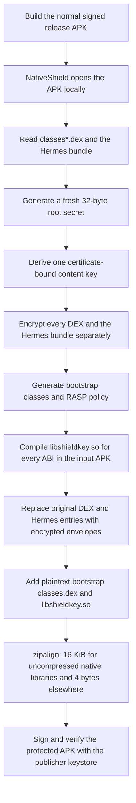
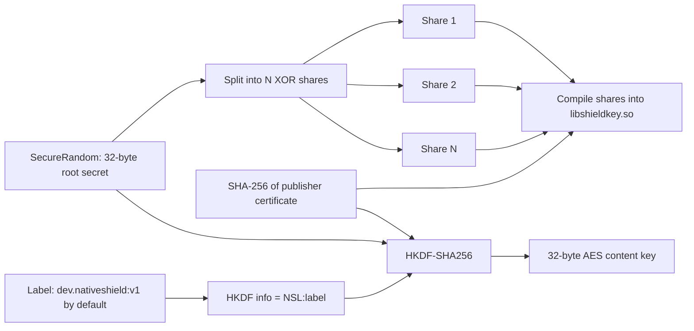
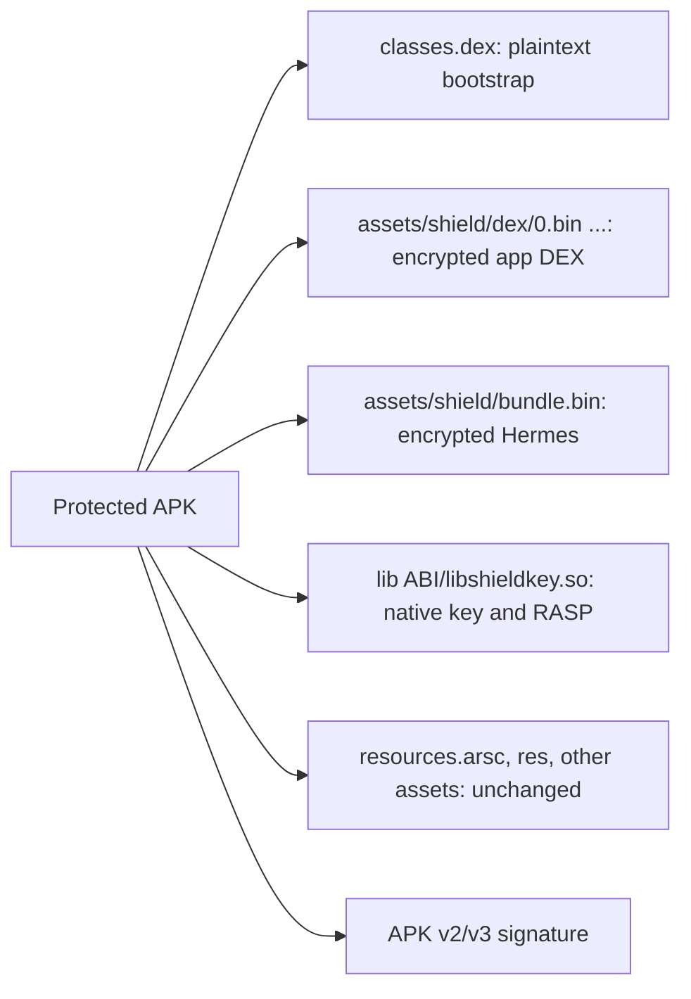
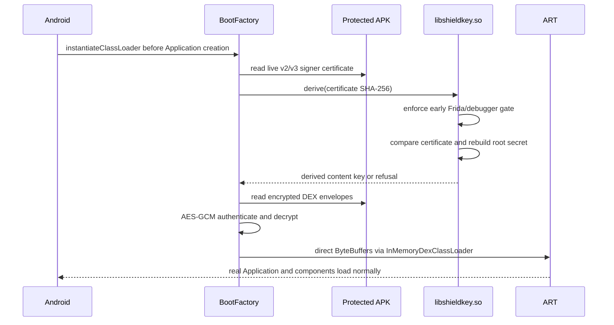
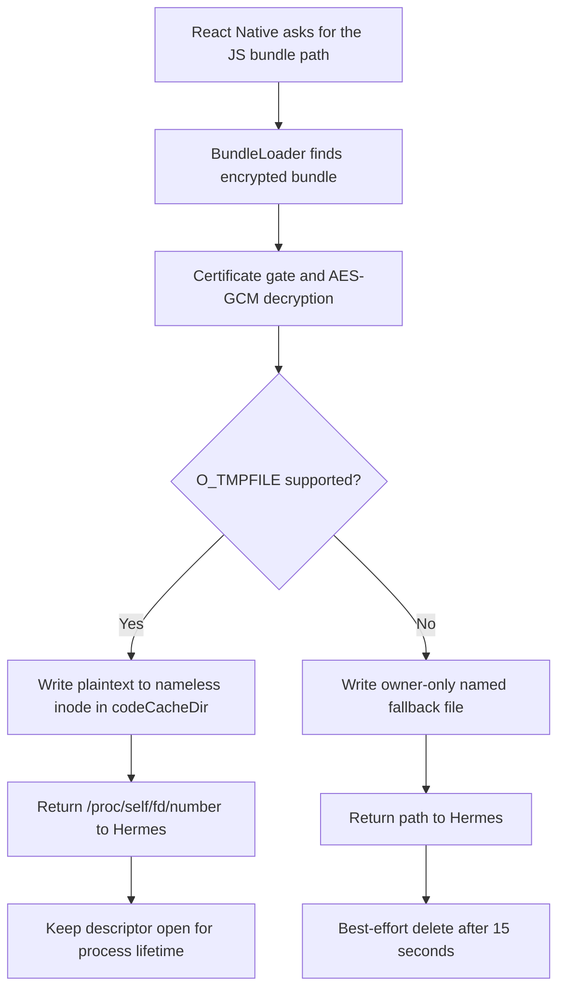
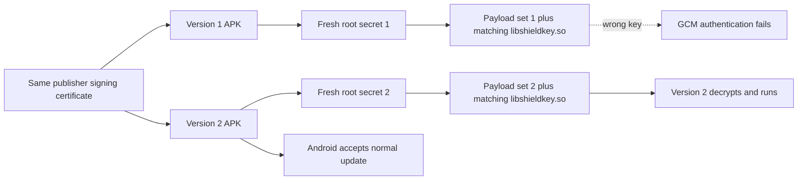
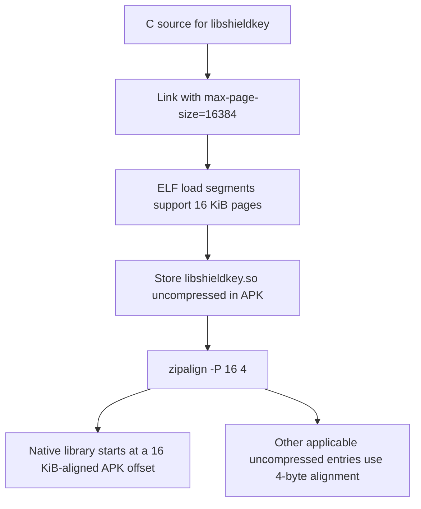
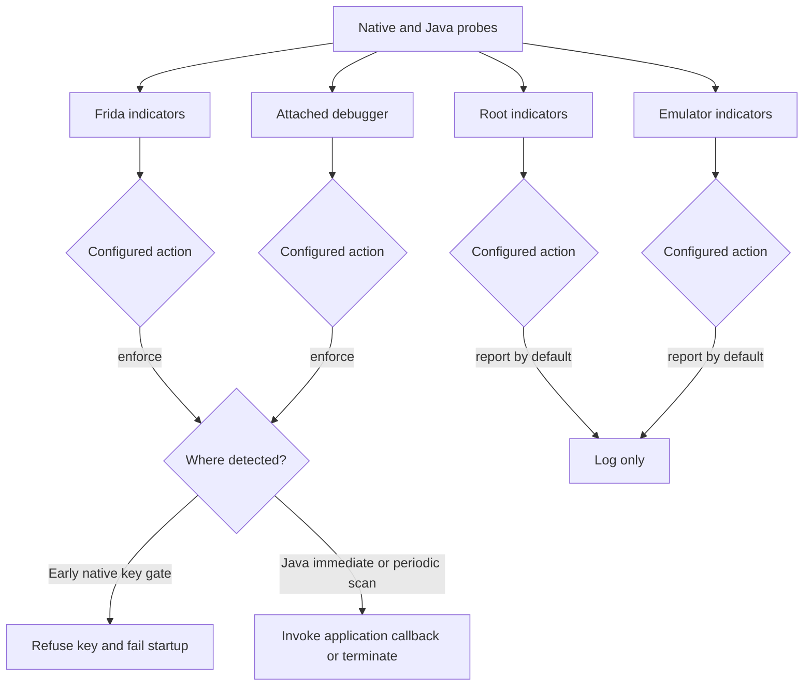
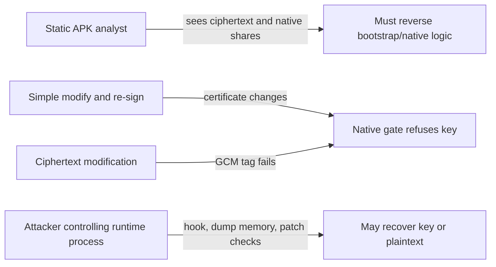

# NativeShield

NativeShield is an offline post-build protector for Android applications that use
React Native and Hermes. V1 replaces the application DEX files and Hermes bytecode
bundle with authenticated ciphertext, injects an early bootstrap loader, binds the
decryption key to the APK signing certificate, and adds configurable runtime
self-protection (RASP).

NativeShield raises the cost of static analysis, tampering, and routine repackaging.
It does not make a client device or an APK unbreakable. A sufficiently capable
attacker who controls the device can instrument the process, reverse the native key
code, or capture plaintext after decryption.

## Current V1 scope

| APK content or control | V1 behavior |
| --- | --- |
| Application `classes*.dex` | AES-256-GCM encrypted |
| Hermes `assets/index.android.bundle` | AES-256-GCM encrypted |
| Android `resources.arsc`, XML, drawables, and ordinary assets | Left unchanged and readable |
| Bootstrap `classes.dex` | Plaintext; required for Android to start the app |
| `libshieldkey.so` | Plaintext native code containing split key-derivation material |
| Signing identity | Live APK certificate hash must match the hash baked into the native library |
| RASP | Frida/debugger enforce by default; root/emulator report by default |
| Network | No internet or server dependency; the only socket probe is loopback to Frida's default ports |
| Minimum Android version | API 30 |

Resource encryption is not implemented in this V1. Encrypting Android's compiled
resource table transparently requires a separate resource-loader architecture and a
much broader compatibility test matrix.

The supported release entry point is `pack_app.py`. The older `build.py`,
`pack_rn_fixture.py`, and `test_*.py` files are experimental fixture harnesses; their
fixture projects and recorded evidence are not part of this repository and they are
not the V1 application packer described below.

## Architecture flowcharts

### 1. Packaging an application



The packer works locally. The input APK, signing keystore, passwords, plaintext
payloads, generated secrets, and output APK are not uploaded by NativeShield.

### 2. Creating and locating the key material



The XOR shares are obfuscation, not a cryptographic secret-sharing threshold. All
shares are in the same native library, so reversing that library can recover the root
secret. The content key itself is derived only when needed and is zeroed after use.

### 3. Encrypting each payload

```mermaid
flowchart TD
    P[Plain DEX or Hermes bytes] --> G[AES-256-GCM encrypt]
    K[Derived 32-byte content key] --> G
    N[Fresh random 12-byte nonce] --> G
    A[AAD: NativeShieldLab:v1 plus payload identity] --> G
    G --> O[NSL1 magic | nonce | ciphertext | 16-byte GCM tag]

    I1[Identity dex/0] --> A
    I2[Identity dex/1 ...] --> A
    I3[Identity bundle] --> A
```

The identity is authenticated as additional data. Moving a valid `dex/0` envelope to
`dex/1`, changing ciphertext, using the wrong key, or changing the GCM tag causes
authentication to fail.

### 4. Protected APK layout



The original root-level application DEX files and
`assets/index.android.bundle` are removed. A different `classes.dex` remains because
Android needs executable bootstrap code before protected application code can exist.

### 5. DEX decryption at startup



Plain DEX bytes are placed in direct memory buffers. NativeShield does not write a
plaintext DEX file to app storage. The process and ART still see executable plaintext;
a compromised process can inspect it, and ART may create its own runtime metadata or
compiled artifacts under Android-managed private directories.

### 6. Hermes decryption and temporary storage



The primary Hermes path is disk-backed but has no directory entry. It exists while the
held file descriptor is open and Android reclaims it when the process exits. The
fallback briefly creates a named plaintext file. Neither path prevents a privileged or
instrumented attacker from reading plaintext while the process is running.

### 7. Updating with a new encryption key



Every pack creates a new root secret. An update works because each protected APK ships
its own matching ciphertext and native derivation material. Android retains normal app
data when the package name and accepted signing identity are unchanged. A key mismatch
fails startup rather than silently producing corrupted DEX or Hermes bytes.

### 8. Why both 16 KiB operations exist



The linker fixes the internal ELF segment alignment. `zipalign -P 16 4` fixes the
library's byte offset inside the APK. Both are needed for direct mmap on 16 KiB-page
devices. This only guarantees alignment for the newly generated `libshieldkey.so`; it
does not repair older React Native, Hermes, or third-party `.so` files already present
in the input APK.

### 9. Runtime protection policy



The Frida probes inspect this process's memory map and thread names, check common local
paths, and make a D-Bus authentication probe to loopback ports 27042 and 27043. A TCP
connection alone is not treated as Frida. The debugger probe reads `TracerPid`; root
and emulator probes inspect common device signals. These are heuristics and require
device testing before changing root or emulator policy to `enforce`.

### 10. Security boundary



Certificate binding is useful against ordinary repackaging, but it is another local
check that can be patched. Android's APK signature protects the genuine distributed
artifact; NativeShield adds authenticated payloads and runtime cost inside that
artifact.

## Source integration

The release manifest must install the bootstrap before Android creates application
components:

```xml
<manifest xmlns:android="http://schemas.android.com/apk/res/android"
          xmlns:tools="http://schemas.android.com/tools">
    <application
        android:appComponentFactory="lab.shield.BootFactory"
        tools:replace="android:appComponentFactory" />
</manifest>
```

If the application already uses a custom or AndroidX component factory, pass its fully
qualified class name as `--original-factory`. `BootFactory` constructs that factory
from the decrypted class loader and delegates component creation to it.

React Native must ask `BundleLoader` for the protected bundle before falling back to
its normal bundle location. Because the injected class does not exist until pack time,
an existing application can keep an unprotected development build working by using a
small reflection bridge:

```java
private String protectedBundlePath(Context context) {
    try {
        Class<?> loader = Class.forName("lab.shield.BundleLoader");
        return (String) loader.getMethod("pathIfPresent", Context.class)
                .invoke(null, context);
    } catch (ClassNotFoundException absentInPlainBuild) {
        return null;
    } catch (Exception protectionFailure) {
        throw new SecurityException("protected bundle initialization failed", protectionFailure);
    }
}
```

Call `lab.shield.Rasp.start(Context, Runnable)` from `Application.onCreate`, normally
through reflection for the same reason, to enable the periodic scan and supply the
application's enforced-threat screen. The early native key gate works automatically
during protected DEX decryption, before `Application.onCreate`; it enforces only Frida
and debugger signals to reduce startup false positives.

See [docs/architecture.md](docs/architecture.md) for the detailed lifecycle and
integration checklist.

## Packer parameters

| Argument | Meaning |
| --- | --- |
| `--apk` | Already-built release APK containing `classes*.dex` and `assets/index.android.bundle` |
| `--out` | Final protected and signed APK path |
| `--work` | Disposable local work directory; contains plaintext payload copies during packing |
| `--keystore` | Local signing keystore path |
| `--alias` | Signing key alias |
| `--storepass` | Keystore password |
| `--keypass` | Key password |
| `--cert-sha256` | Optional certificate hash; derived from the keystore when omitted |
| `--label` | HKDF domain-separation label; default `dev.nativeshield:v1` |
| `--original-factory` | Existing application component factory to delegate to |
| `--build-tools` | Installed Android Build Tools version; default `35.0.0` |
| `--platform` | Installed Android SDK platform used to compile bootstrap classes; default `android-32` |
| `--ndk` | Installed Android NDK directory |
| `--min-sdk` | D8 and native minimum API; default `30` |
| `--shares` | Number of XOR shares embedded in the native library; default `4`, minimum `2` |

The `--label` used to encrypt and the label embedded in `libshieldkey.so` are generated
in the same pack operation. Changing it between APK versions is safe because the new
APK contains a matching payload and library.

## RASP build policy

RASP policy is read from environment variables when the APK is packed:

| Variable | Values | Default |
| --- | --- | --- |
| `SHIELD_RASP` | `true` or `false` | `true` |
| `SHIELD_RASP_MODE` | `off`, `report`, or `enforce` for every category | Category defaults |
| `SHIELD_RASP_FRIDA` | `off`, `report`, `enforce` | `enforce` |
| `SHIELD_RASP_DEBUG` | `off`, `report`, `enforce` | `enforce` |
| `SHIELD_RASP_ROOT` | `off`, `report`, `enforce` | `report` |
| `SHIELD_RASP_EMULATOR` | `off`, `report`, `enforce` | `report` |
| `SHIELD_RASP_PERIODIC` | `true` or `false` | `true` |
| `SHIELD_RASP_PERIOD_MS` | Interval from 250 to 3,600,000 milliseconds | `3000` |
| `SHIELD_RASP_CRYPTO_GATE` | `true` or `false` | `true` |

Per-category variables override `SHIELD_RASP_MODE`. `off`, `report`, and `enforce`
become constants in the generated Java and C configuration; they are not changed by a
remote service.

## Offline build

Required local tools:

- Python 3
- JDK with `javac`, `java`, and `keytool`
- Android SDK platform selected by `--platform`
- Android Build Tools selected by `--build-tools`
- Android NDK with LLVM toolchains for every ABI in the input APK

Example:

```sh
export JAVA_HOME=/absolute/path/to/jdk
export ANDROID_HOME=/absolute/path/to/android-sdk

python3 pack_app.py \
  --apk /absolute/path/to/app-release.apk \
  --out /absolute/path/to/app-protected.apk \
  --work /absolute/path/to/disposable-work \
  --keystore /absolute/path/to/release.keystore \
  --alias release \
  --storepass "$NS_STORE_PASS" \
  --keypass "$NS_KEY_PASS" \
  --ndk "$ANDROID_HOME/ndk/27.0.12077973" \
  --original-factory androidx.core.app.CoreComponentFactory
```

Use a trusted offline build machine. The current CLI receives passwords as command
arguments, and the work directory temporarily contains plaintext DEX and Hermes files.
Restrict access to both and remove the work directory after validating the output. Do
not commit APKs, work directories, generated headers, or signing material.

## Verification

The repository includes a platform-independent test for the main cryptographic
properties:

```sh
mkdir -p /tmp/nativeshield-test
javac -d /tmp/nativeshield-test \
  runtime/lab/shield/Envelope.java \
  core/lab/shield/KeyBinding.java \
  core/test/DeriveTest.java
java -cp /tmp/nativeshield-test DeriveTest
```

For every application release, also verify the actual protected APK:

- It installs and cold-starts repeatedly on every supported API/ABI/device family.
- Unprotected application DEX, the original Hermes bundle, and chosen sensitive
  markers are absent from the archive.
- One-byte corruption of each encrypted payload fails closed.
- Re-signing with a different certificate fails closed.
- A new pack with a new random root secret starts and preserves normal application data.
- Frida before launch and after launch follows the selected policy.
- Debugger-free production flows, background/foreground transitions, services,
  providers, notifications, process recreation, and application-specific peripherals
  remain functional.
- Every native library in the APK, not only `libshieldkey.so`, is checked for 16 KiB
  compatibility where required.

Passing the included host test does not prove those application and device behaviors.

## License and credit

NativeShield is released under the [MIT License](LICENSE).

The RASP work was informed by the threat catalogue and open-source research in
[Duck Detector Refactoring](https://github.com/eltavine/Duck-Detector-Refactoring),
which is licensed under Apache License 2.0. NativeShield's compact implementation was
written for this repository. See [ACKNOWLEDGEMENTS.md](ACKNOWLEDGEMENTS.md).
