# NativeShield V1 architecture

This document describes the supported `pack_app.py` V1 path. It separates the offline
packing phase from Android startup, records where plaintext and key material exist,
and states the compatibility boundary of V1. Other top-level build/test scripts are
older experimental fixture harnesses and are not the release packer described here.

## Protection boundary

NativeShield protects application DEX files and the Hermes bytecode bundle. Android's
compiled resource table, XML, images, strings, and other ordinary assets stay in their
normal APK locations. The bootstrap and native library stay executable and therefore
readable to static tools.

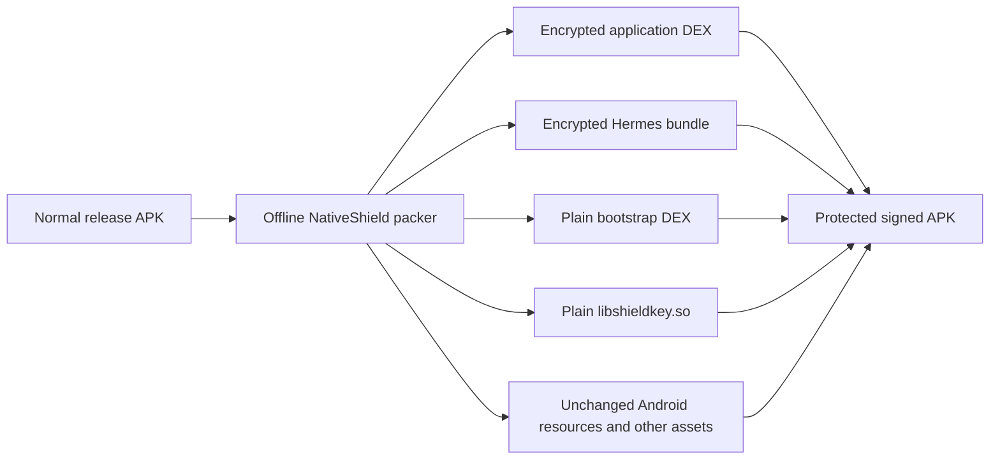

The design targets API 30 and newer. It avoids an Application swap: Android loads
`BootFactory`, that factory installs an in-memory payload class loader, and the original
Application class is then constructed normally.

## Phase A: application preparation

The application must already be able to produce a normal release APK. The release
manifest names `lab.shield.BootFactory` as `android:appComponentFactory`. If another
factory is required, its class name is supplied to `--original-factory` so the injected
factory can delegate to it after the payload class loader exists.

React Native's host must call `BundleLoader.pathIfPresent(context)` when selecting the
release JS bundle. A reflection bridge lets the same source produce ordinary builds in
which NativeShield classes have not been injected.

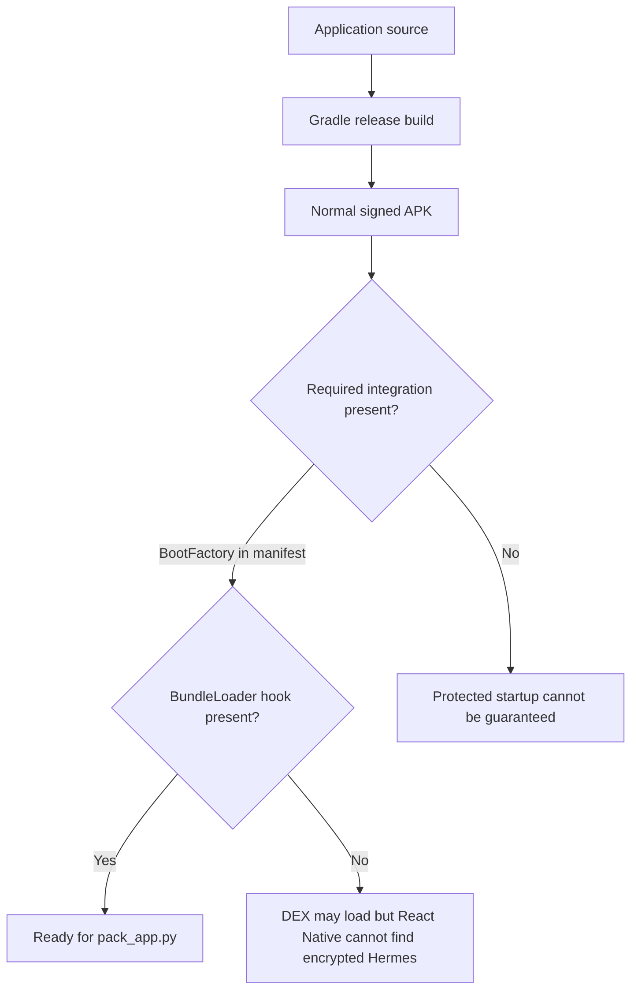

## Phase B: key generation and derivation

At every pack, Python's `secrets.token_bytes(32)` creates a fresh 256-bit root secret.
`gen_native_secret.py` creates `N-1` random 32-byte shares and makes the last share the
XOR needed to reconstruct the root:

```text
root = share[0] XOR share[1] XOR ... XOR share[N-1]
```

Every share, the expected certificate SHA-256, and the HKDF information string are
compiled into `libshieldkey.so`. Splitting keeps the complete root out of one obvious
constant array. Because every share ships in the same APK, this is obfuscation and does
not stop a determined reverse engineer from reconstructing the root.

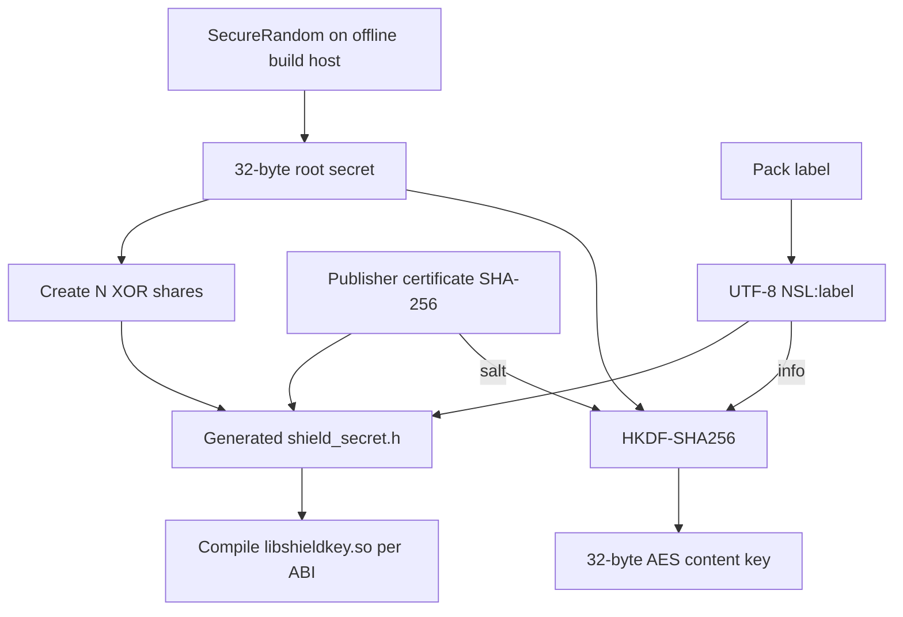

The exact derivation is:

```text
contentKey = HKDF-SHA256(
    inputKeyMaterial = rootSecret,
    salt             = SHA-256(publisher signing certificate),
    info             = UTF-8("NSL:" + label),
    outputLength     = 32 bytes
)
```

The keystore and private signing key are never placed in the APK. They remain on the
offline build machine and are used by `keytool`/`apksigner`. The public certificate is
part of every signed APK by design; NativeShield embeds only its SHA-256 value for the
native equality gate.

## Phase C: authenticated payload encryption

The packer derives the content key once and encrypts each input independently with
AES-256-GCM. Each envelope gets a fresh 96-bit random nonce. The payload identity is
authenticated additional data (AAD), so encrypted entries cannot be silently swapped.

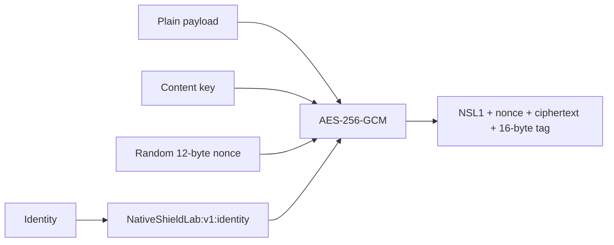

Envelope bytes:

```text
offset  size       meaning
0       4          ASCII magic NSL1
4       12         random GCM nonce
16      variable   ciphertext
end-16  16         GCM authentication tag
```

Identities are `dex/0`, `dex/1`, and so on for sorted root-level DEX entries, plus
`bundle` for `assets/index.android.bundle`. `Envelope.decrypt` rejects an invalid
header, a payload over the configured limit, a wrong identity, a wrong key, and any
authenticated-byte modification.

## Phase D: APK reconstruction

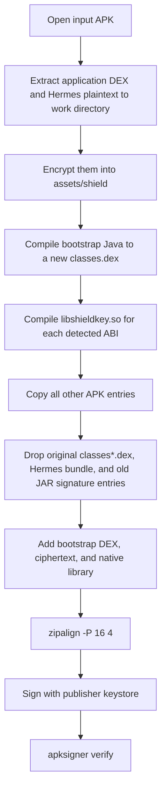

`--work` is deliberately disposable. It contains plaintext copies of application DEX
and Hermes bytes while the packer runs, along with generated headers that reveal the
native key material. Use a restricted local directory and delete it after validation.

The output layout is:

```text
classes.dex                         plaintext NativeShield bootstrap
assets/shield/dex/0.bin             encrypted former classes.dex
assets/shield/dex/1.bin             encrypted former classes2.dex, when present
assets/shield/bundle.bin            encrypted former index.android.bundle
lib/<abi>/libshieldkey.so           native key derivation and RASP
resources.arsc, res/**, assets/**   unchanged V1 content
META-INF/** or APK Signing Block    new output signature metadata
```

## Phase E: early DEX loading

Android calls `AppComponentFactory.instantiateClassLoader` before it constructs the
Application. `BootFactory` uses that point to decrypt every DEX envelope and create an
`InMemoryDexClassLoader`.

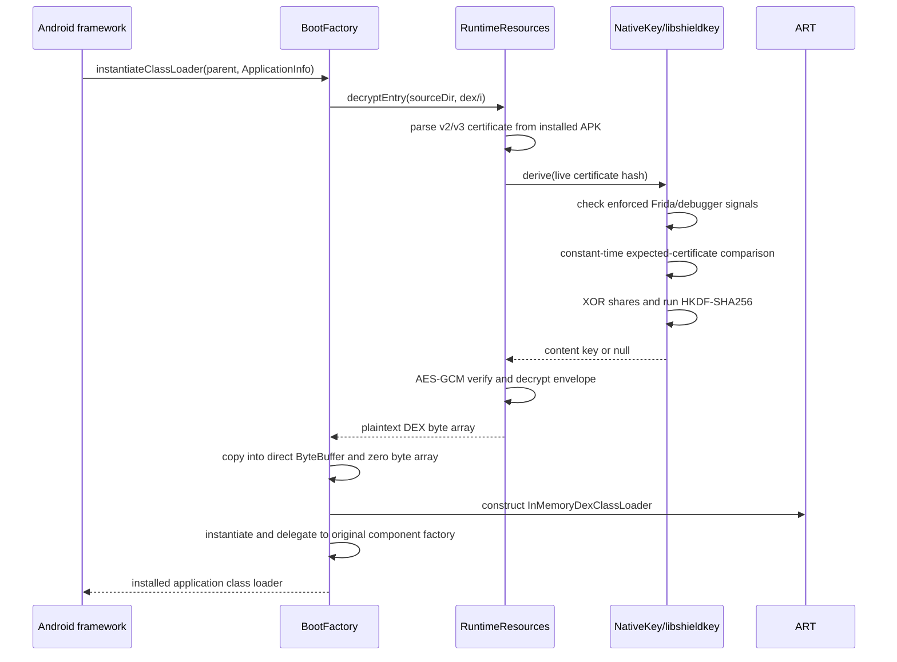

If signer verification, the native RASP gate, or GCM authentication fails,
`BootFactory` throws `SecurityException("encrypted DEX initialization failed")`. The
real Application is not created.

### DEX plaintext lifetime

NativeShield does not cache decrypted DEX as a named file. The temporary Java arrays
are filled with zero after copying. The direct DEX buffers and ART's executable/runtime
representations remain for as long as the process needs the classes. Process exit
releases those mappings. ART can still maintain Android-controlled optimization and
metadata files in private storage; this design does not promise that every derived
runtime representation exists only in RAM.

## Phase F: Hermes loading

The encrypted bundle cannot be passed directly to Hermes as an arbitrary Java byte
array. Hermes expects a path it can open or memory-map. `BundleLoader` therefore uses
an app-private file-system object.

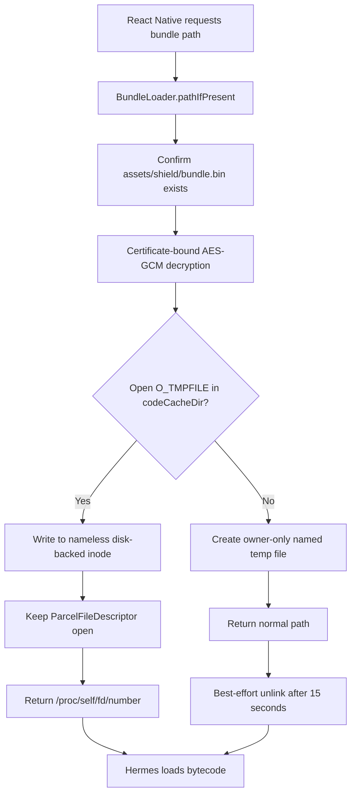

On the primary path, no filename points to the plaintext, but the nameless inode remains
disk-backed and alive while the descriptor is open. Android's file-based encryption
protects it at rest according to the app/device state. On the fallback path, the name
can be visible for about 15 seconds and deletion is best effort. A crash before the
deletion thread runs can leave the fallback file in `codeCacheDir`; Android may later
clear cache data, but NativeShield does not guarantee immediate cleanup in that case.

## Phase G: RASP

The RASP module has four detection categories and three actions:

| Category | Native/Java signals | Default action |
| --- | --- | --- |
| Frida | `/proc/self/maps`, thread names, known paths, confirmed D-Bus reply on loopback default ports | Enforce |
| Debugger | Native `TracerPid`, Java `Debug` APIs | Enforce |
| Root | KernelSU probe, common paths, mount information, Java test-key tags | Report |
| Emulator | Common QEMU/goldfish paths and CPU information | Report |

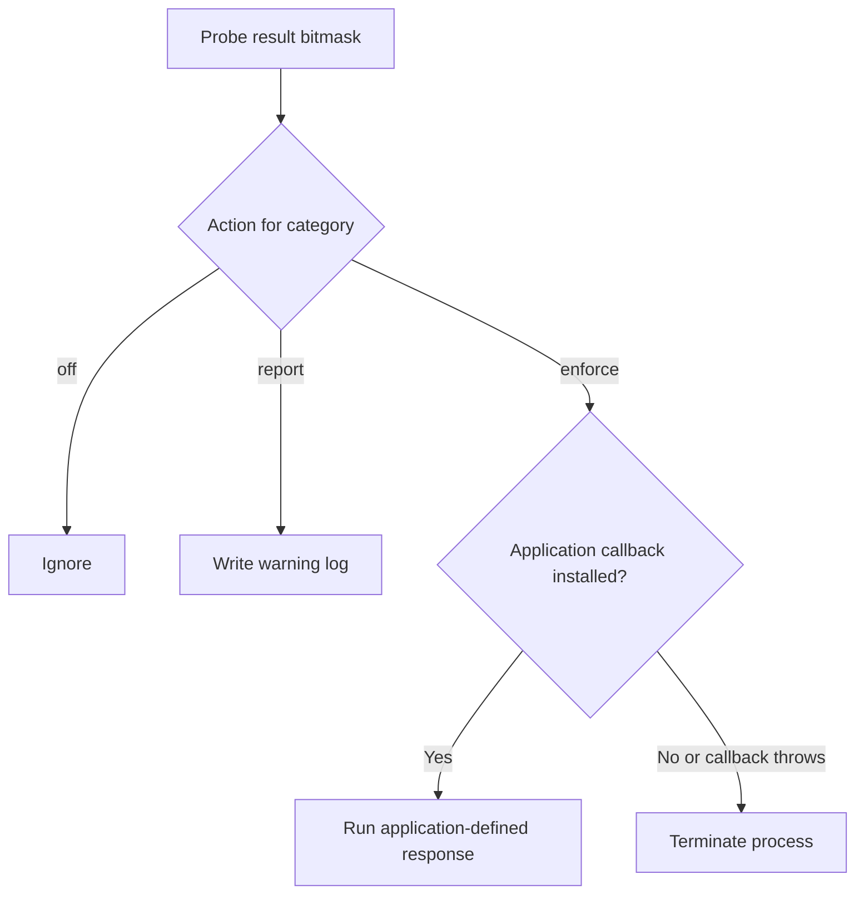

The native key gate runs automatically before key derivation and checks only enforced
Frida and debugger signals. This is the earliest protection point and occurs before an
application callback can exist. The Java `Rasp.start` call performs an immediate full
scan, registers the callback, and optionally starts the periodic worker. `Rasp.checkNow`
can be called before an application-specific sensitive operation.

All checks are bypassable by an attacker who can patch or hook the process. They are
intended to detect common tooling and raise analysis cost. Root/emulator checks remain
report-only by default because OEM software, test devices, and unusual production
images can share heuristic signals.

## Phase H: updates and key rotation

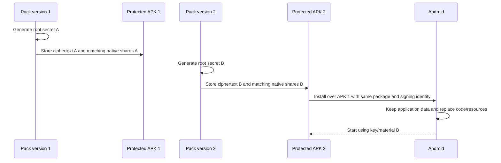

No server distributes the new key. Each APK is self-contained. The same publisher
certificate continues to satisfy Android's update rules and NativeShield's embedded
certificate gate. Android signing-key rotation needs separate validation because
`ApkCert` currently selects the first certificate in the active v2/v3 signer block; it
does not implement Android signing lineage policy itself.

## Phase I: 16 KiB page support

There are two distinct alignment layers:

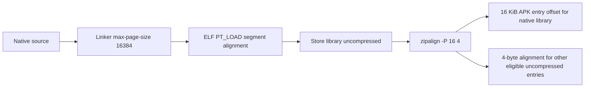

The linker's `-Wl,-z,max-page-size=16384` controls addresses and offsets inside the ELF
file. `zipalign -P 16 4` controls where an uncompressed `.so` begins inside the ZIP/APK.
The trailing `4` is bytes, not 4 KiB.

NativeShield builds `libshieldkey.so` correctly for this model. Compatibility of the
whole APK still depends on every existing React Native, Hermes, and third-party native
library. The packer copies those libraries unchanged, so an old 4 KiB-aligned input
library remains old 4 KiB-aligned code even if its ZIP entry is repositioned.

## Parameter data flow

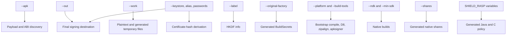

`--cert-sha256` overrides automatic certificate-hash extraction. It should normally be
omitted so the encryption salt and native expected hash come from the same keystore
that signs the final output.

## Offline and secret handling

`pack_app.py` invokes local Python, JDK, Android SDK, and NDK executables. It has no HTTP
client and makes no network request. Runtime RASP connects only to `127.0.0.1` on the
two conventional Frida ports; it sends no application data.

The current command-line interface accepts keystore passwords as arguments, which can
be visible to other local processes depending on the host OS. Use a dedicated trusted
build host with restricted user access. The work directory and generated native header
also contain enough material to recover the content key for that build. Remove them
after the protected APK has passed validation.

## Failure behavior

| Failure | Current outcome |
| --- | --- |
| Missing or malformed encrypted DEX | Early `SecurityException`; Application is not created |
| Wrong/re-signed certificate | Native derivation refusal; decryption fails |
| DEX or Hermes ciphertext modified | AES-GCM authentication failure |
| Enforced Frida/debugger detected during key derivation | Native derivation refusal |
| Enforced threat after `Rasp.start` | Application callback; process termination if unavailable/failing |
| Root/emulator default detection | Log report only |
| `O_TMPFILE` unavailable | Named Hermes cache fallback with delayed best-effort deletion |

## Release qualification checklist

Run qualification on the exact protected release artifact, not only on a sample app:

1. Build the unprotected APK and record its hash, package ID, version, and signer.
2. Pack it with a newly generated root secret and an empty disposable work directory.
3. Verify the output signature and signer with `apksigner verify --verbose --print-certs`.
4. Inspect the ZIP: original DEX/Hermes bytes and chosen sensitive markers must be
   absent; encrypted envelopes and bootstrap/native entries must be present.
5. Install and cold-start repeatedly across supported APIs, ABIs, OEM families, and
   4 KiB/16 KiB page sizes.
6. Exercise React Native foreground/background transitions, process death, deep links,
   providers, services, receivers, notifications, and application-specific hardware flows.
7. Corrupt one byte in each encrypted entry, re-sign with the expected test setup, and
   confirm startup fails with GCM authentication errors.
8. Re-sign a copy with a different disposable certificate and confirm key refusal.
9. Pack a new application version with a fresh key, install it as an update, and confirm
   startup plus persistence of normal app data.
10. Test Frida before process launch and after launch, debugger attachment, rooted
    devices, and clean production devices under the exact selected policy.
11. Check every `.so` in the final APK for 16 KiB compatibility when that support is a
    release requirement.

## Known limitations

- Local key material can ultimately be extracted because the client must decrypt
  locally and all derivation inputs ship with the application.
- A runtime attacker may hook after decryption, dump in-memory DEX, copy the Hermes
  temporary object, or patch the native/Java checks.
- Android resources and ordinary assets remain plaintext in V1.
- The Hermes primary path is nameless but disk-backed; the fallback is temporarily
  named and deletion is best effort.
- The packer reads each protected payload fully into memory and enforces a 128 MiB
  envelope limit.
- RASP signals are heuristic. Policy must be qualified on the supported device fleet.
- Generated `libshieldkey.so` alignment does not upgrade native libraries copied from
  the input APK.
- Compatibility with future Android releases must be tested on preview/final platform
  builds; no post-build protector can guarantee an untested OS implementation forever.

## Credits

The RASP design was informed by the threat catalogue and open-source research in
[Duck Detector Refactoring](https://github.com/eltavine/Duck-Detector-Refactoring).
NativeShield's compact runtime was implemented for this repository. See
[ACKNOWLEDGEMENTS.md](../ACKNOWLEDGEMENTS.md) for the licensing note.
